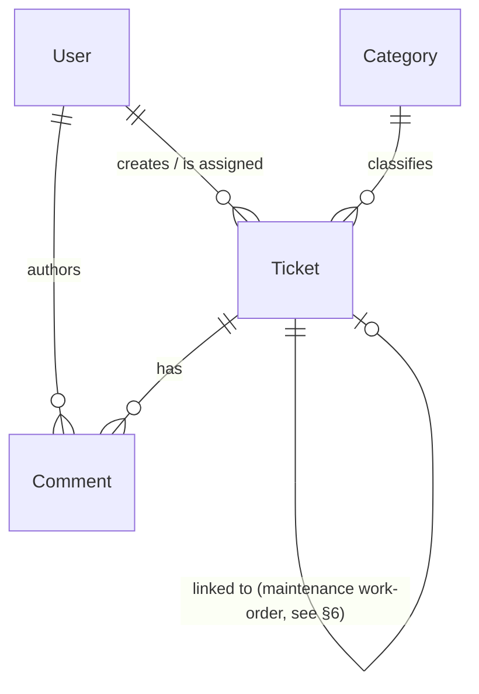

# Data Model — Helpdesk MVP

**Role:** Senior Product Engineer (data modeling)
**Source of truth:** `requirement.md`
**Principle:** minimum viable schema. No premature normalization. No speculative fields.

---

## 1. Entities at a Glance

| # | Entity | Purpose | Lifetime |
|---|---|---|---|
| 1 | **User** | Local cache of identity + role | Created on first login, kept while user is active |
| 2 | **Category** | Lookup table for ticket classification | Long-lived; managed by Admin |
| 3 | **Ticket** | The core record | Created → Resolved → Closed (per BR-01) |
| 4 | **Comment** | Public/internal notes on a ticket | Append-only (no edit, no delete in MVP) |
| 5 | ~~Event (outbox)~~ | *Implementation-only, see §7* | Optional |

---

## 2. Entity: `User`

We do **not** own authentication, but we still need a local record so we can attach a **role** (Requester / Agent / Admin) and a display name to ticket authorship. Identity is the source of truth for credentials.

### Fields

| Field | Type | Required | Notes |
|---|---|---|---|
| `id` | string | ✅ | Primary key. **Equal to the Identity service's user id.** |
| `display_name` | string | ✅ | Cached from Identity at first login; refreshed on every login. |
| `email` | string | ✅ | Cached from Identity; used for notifications. |
| `role` | enum | ✅ | One of: `Requester`, `Agent`, `Admin`. |
| `created_at` | timestamp | ✅ | First time we saw this user. |
| `last_seen_at` | timestamp | ✅ | Updated on every successful login. |

> **Not stored:** password, password hash, MFA secrets, OAuth refresh tokens, session cookies — all delegated to Identity (NFR-04, CON-05).

### Relationships

- `User 1 — N Ticket` as **requester** (a user creates many tickets).
- `User 1 — N Ticket` as **assignee** (an Agent is assigned many tickets; null when unassigned).
- `User 1 — N Comment` as **author**.

### CRUD

| Action | Requester | Agent | Admin | System |
|---|:---:|:---:|:---:|:---:|
| Create | — | — | — | ✅ on first login |
| Read (own profile) | ✅ | ✅ | ✅ | ✅ |
| Read (list of all) | ❌ | ❌ | ✅ | — |
| Update role | ❌ | ❌ | ✅ | — |
| Update display_name / email | — | — | — | ✅ on each login (refresh from Identity) |
| Delete | ❌ | ❌ | ✅ (rare, audited) | — |

---

## 3. Entity: `Category`

A small lookup table maintained by Admin. Priorities are **not** a table — they are a fixed enum (Low / Medium / High / Urgent).

### Fields

| Field | Type | Required | Notes |
|---|---|---|---|
| `id` | string (slug) | ✅ | PK, e.g. `it`, `facility`, `academic`. Stable, URL-safe. |
| `name` | string | ✅ | Human-readable label, e.g. "IT Support". |
| `description` | string | ❌ | One-line tooltip. |
| `is_active` | boolean | ✅ | Default `true`. Soft-delete flag. |
| `created_at` | timestamp | ✅ | — |
| `updated_at` | timestamp | ✅ | — |

### Relationships

- `Category 1 — N Ticket`.

### CRUD

| Action | Requester | Agent | Admin |
|---|:---:|:---:|:---:|
| Read active list | ✅ | ✅ | ✅ |
| Create | ❌ | ❌ | ✅ |
| Rename / update description | ❌ | ❌ | ✅ |
| Deactivate (soft-delete) | ❌ | ❌ | ✅ |
| Hard-delete | ❌ | ❌ | ✅ only if no tickets reference it |

---

## 4. Entity: `Ticket`

The core record. Designed around BR-01 state machine and FR-02/FR-13.

### Fields

| Field | Type | Required | Notes |
|---|---|---|---|
| `id` | string | ✅ | PK. **Monotonic, opaque** (BR-12). E.g. `T-000123`. Never reused. |
| `requester_id` | FK → User.id | ✅ | The user who opened the ticket. Immutable. |
| `assignee_id` | FK → User.id | ❌ | Null while unassigned. Must reference a user with role ∈ {Agent, Admin}. |
| `category_id` | FK → Category.id | ✅ | Must reference an active category at write time. |
| `subject` | string (≤ 200 chars) | ✅ | Short title. |
| `description` | text (≤ 5000 chars) | ✅ | Free-form plain text. |
| `priority` | enum | ✅ | `Low`, `Medium`, `High`, `Urgent`. |
| `status` | enum | ✅ | `Open`, `Assigned`, `InProgress`, `Resolved`, `Closed` (BR-01). |
| `maintenance_work_order_id` | string | ❌ | Set by Agent (FR-12). At most one at a time (BR-08). |
| `resolution_note` | text | ❌ | Set when transitioning to `Resolved` (FR-13). |
| `created_at` | timestamp | ✅ | Set at creation, immutable. |
| `updated_at` | timestamp | ✅ | Bumped on any field change. |
| `resolved_at` | timestamp | ❌ | Set on transition to `Resolved`. |
| `closed_at` | timestamp | ❌ | Set on transition to `Closed`. |
| `escalated_at` | timestamp | ❌ | Set when `ticket.escalated` is emitted (BR-09). |

> **Not stored on Ticket:** the comment thread (lives in `Comment`), the full event history (lives in logs / outbox), the original `category_id` if it was later changed (we keep current value only — history is in events).

### Relationships

- `Ticket N — 1 User` as **requester**.
- `Ticket N — 1 User` as **assignee** (nullable).
- `Ticket N — 1 Category`.
- `Ticket 1 — N Comment`.
- `Ticket N — 1 Ticket` as **linked maintenance work-order** — implemented as a *self-edge by string id* (`maintenance_work_order_id`), **not** as a foreign key, because Maintenance is an external system (CON-05). See §6.

### CRUD

| Action | Requester | Agent | Admin |
|---|:---:|:---:|:---:|
| Create | ✅ | ✅ | ✅ |
| Read (own) | ✅ | ✅ | ✅ |
| Read (any) | ❌ | ✅ | ✅ |
| Update `subject` / `description` | ✅ only while `status = Open` **and** before any Agent edit (BR-03) | ✅ | ✅ |
| Update `category_id`, `priority` | ❌ | ✅ | ✅ |
| Update `assignee_id` | ❌ | ✅ | ✅ |
| Update `maintenance_work_order_id` | ❌ | ✅ | ✅ |
| Update `status` to `Resolved` | ❌ | ✅ | ✅ |
| Update `status` to `Reopened` (within 7 d) | ✅ on own | ✅ | ✅ |
| Hard-delete | ❌ | ❌ | ✅ (BR-11, audited) |

---

## 5. Entity: `Comment`

Append-only thread attached to a ticket. No edit, no delete in MVP — this guarantees audit (NFR-06) and avoids messy edit histories.

### Fields

| Field | Type | Required | Notes |
|---|---|---|---|
| `id` | string | ✅ | PK. Monotonic, opaque. |
| `ticket_id` | FK → Ticket.id | ✅ | — |
| `author_id` | FK → User.id | ✅ | The user who wrote it. Immutable. |
| `body` | text (≤ 5000 chars) | ✅ | Plain text. |
| `visibility` | enum | ✅ | `Public` (visible to requester) or `Internal` (Agents/Admins only — BR-06). |
| `created_at` | timestamp | ✅ | Immutable. |

### Relationships

- `Comment N — 1 Ticket`.
- `Comment N — 1 User`.

### CRUD

| Action | Requester | Agent | Admin |
|---|:---:|:---:|:---:|
| Create public on own ticket | ✅ | ✅ | ✅ |
| Create internal | ❌ | ✅ | ✅ |
| Read public on own ticket | ✅ | ✅ | ✅ |
| Read internal | ❌ | ✅ | ✅ |
| Update | ❌ | ❌ | ❌ (append-only) |
| Delete | ❌ | ❌ | ✅ (BR-11, audited) |

---

## 6. Relationship: Maintenance Work-Order Link

Per FR-12, FR-14, BR-08 a ticket may reference **at most one** Maintenance work-order at a time.

**Why not a join table?**

- The Maintenance system is **external** (CON-05). We have no FK to enforce and no need for our own join entity.
- A single string field on `Ticket` (`maintenance_work_order_id`) is enough.
- Replacing the link records the previous ID **in the event payload**, not in the database.

**Edge case to handle in code, not schema:**

- A new `maintenance.status_changed` event arrives for a work-order ID that has since been unlinked. The handler must verify the link is still current before updating the ticket status.

---

## 7. Optional / Implementation-Only: `Event` (Outbox)

For BR-10 ("every state transition publishes exactly one event") to be reliable under crash, a small **outbox table** is recommended. It is **not** part of the domain model — it's an implementation pattern.

| Field | Type | Required | Notes |
|---|---|---|---|
| `id` | string | ✅ | PK. |
| `event_type` | string | ✅ | `ticket.created`, `ticket.escalated`, `ticket.resolved`, etc. |
| `aggregate_id` | string | ✅ | The ticket id. |
| `payload` | json | ✅ | Full event body. |
| `created_at` | timestamp | ✅ | — |
| `published_at` | timestamp | ❌ | Set after the broker confirms delivery. |

A separate process polls/reads unpublished rows and ships them. If this is too complex for a 1-semester team, an acceptable MVP fallback is **synchronous publish + log on failure**, documented as a known limitation.

---

## 8. Data That Should NOT Be Stored

| Data | Reason | Reference |
|---|---|---|
| Passwords / password hashes / MFA secrets | Owned by Identity service | NFR-04, CON-05 |
| OAuth tokens, refresh tokens, session cookies | Owned by Identity service | NFR-04 |
| Raw email / LINE messages | Out-of-scope channels | Problem §8 |
| File attachments / uploads | Out-of-scope | Problem §8 |
| LLM embeddings / model outputs | No LLM in MVP | CON-06 |
| End-user IP addresses, device fingerprints, browser fingerprints | Privacy (NFR-05) | NFR-05 |
| Third-party tracking cookies / analytics tags | Privacy (NFR-05) | NFR-05 |
| Free-text comments from a previous system we migrate from | No migration in MVP | — |
| Historical category names after a rename | Use current category; history lives in events | — |
| SLA timer state, breach count | SLA timers are out-of-scope | Problem §8 |

---

## 9. Sensitive Data

| Data | Sensitivity | Handling |
|---|---|---|
| `User.email` | PII | Encrypted at rest if the DB supports it (free-tier Postgres usually does). Never exposed in API list responses. Visible to the user themselves and to Admins. |
| `User.display_name` | PII | Same as email. |
| `Ticket.description` | May contain sensitive context (academic complaints, health, accessibility needs) | Treated as confidential. Access controlled (BR-02). Not exported via any third-party analytics. |
| `Ticket.id` — *opaque but monotonic* | Low | Safe to log, safe to put in URLs and notifications. |
| `maintenance_work_order_id` | Low–medium (may hint at internal asset) | Internal-only field; never shown to the requester. |
| Identity ID (`User.id`) | Medium (links to campus records) | Never logged at verbose level; do not put in URLs. |

---

## 10. Potential Duplicate or Inconsistent Data

| Risk | Source | Mitigation |
|---|---|---|
| `User.display_name` / `email` out of sync with Identity | Cached locally | **Identity is source of truth.** Refresh on every login. Never edit locally except via Admin. |
| Two categories with the same `name` | Admin typo | DB-level `UNIQUE` constraint on `lower(name) WHERE is_active`. |
| Category renamed while open tickets reference the old name | Admin action | Tickets keep the **current** category; old label exists only in event history. No back-fill needed. |
| Two Agents assign the same ticket at the same time | Concurrent UI clicks | **Optimistic concurrency** on Ticket (`updated_at` check on update). Loser gets a friendly conflict message. |
| Status changed but event not published | Crash between DB write and broker send | Outbox pattern (§7). Without outbox: log on failure + documented known limitation. |
| `maintenance.status_changed` arrives after the work-order ID has been unlinked | Stale event | Handler must re-verify link before applying update (see §6). |
| Ticket IDs reused after deletion | Bad luck | IDs are monotonic and **never reused** (BR-12). Even hard-deleted tickets keep their id reserved. |
| Comment text encoding differences | Mixed clients | Store as UTF-8; normalize line endings to `\n` on write. |
| Time skew between web client, app server, and DB | Distributed clocks | Always store timestamps from the **DB** (`DEFAULT now()` or equivalent), not from the client. |

---

## 11. Important Database Constraints

A short list of constraints the schema must enforce — the rest are ordinary FKs and NOT NULLs.

### Uniqueness
- `Ticket.id` — PK, unique, monotonic (BR-12).
- `Comment.id` — PK, unique.
- `Category.name` — unique among **active** categories (partial unique index).
- `User.id` — PK, mirrors Identity id.

### Enums (DB-level CHECK or app-level validation)
- `Ticket.priority IN ('Low','Medium','High','Urgent')`.
- `Ticket.status IN ('Open','Assigned','InProgress','Resolved','Closed')`.
- `Comment.visibility IN ('Public','Internal')`.
- `User.role IN ('Requester','Agent','Admin')`.
- `Ticket.assignee_id` — when not null, must reference a `User` with role ∈ {Agent, Admin}.

### Foreign keys & cascades
- `Ticket.requester_id` → `User.id` — `ON DELETE RESTRICT`. We do not allow deleting a user who has tickets.
- `Ticket.assignee_id` → `User.id` — `ON DELETE SET NULL`. If an Agent leaves, tickets become unassigned, not orphaned.
- `Ticket.category_id` → `Category.id` — `ON DELETE RESTRICT`. Categories cannot be hard-deleted while referenced (Admin must deactivate instead).
- `Comment.ticket_id` → `Ticket.id` — `ON DELETE RESTRICT`. Comments persist with tickets.
- `Comment.author_id` → `User.id` — `ON DELETE RESTRICT`.

### State machine (enforced in code, asserted in DB)
- Allowed transitions (BR-01):
  - `Open → Assigned`
  - `Open → InProgress`
  - `Assigned → InProgress`
  - `Assigned → Resolved`
  - `InProgress → Resolved`
  - `Resolved → Closed` (auto, after 7 d)
  - `Resolved → Open` (reopen within 7 d, BR-05)
- `Closed` is terminal. No outbound transitions.

### Other invariants
- `Ticket.maintenance_work_order_id` is either NULL or a non-empty trimmed string.
- `Ticket.resolution_note` is required when status = `Resolved` (assert in code on the transition).
- `Comment.body` length ∈ [1, 5000].
- `Ticket.subject` length ∈ [1, 200].
- `Ticket.description` length ∈ [1, 5000].
- All timestamps are **UTC**, stored with timezone.

---

## 12. Traceability — Requirements ↔ Entities

| Requirement | Entity / Field |
|---|---|
| FR-01 login | (none — Identity-owned) + `User` row created on login |
| FR-02 create ticket | `Ticket.*` |
| FR-03 publish `ticket.created` | `Ticket` + `Event` (outbox) |
| FR-04 my tickets | `Ticket` filtered by `requester_id` |
| FR-05 ticket detail | `Ticket` + `Comment` |
| FR-06 add comment | `Comment` |
| FR-07 rules-engine suggestion | (logic, no entity) writes `Ticket.category_id`, `Ticket.priority` |
| FR-08 agent queue | `Ticket` list sorted by `priority`, `created_at` |
| FR-09 assign | `Ticket.assignee_id` |
| FR-10 change priority/category | `Ticket.priority`, `Ticket.category_id` |
| FR-11 internal comments | `Comment.visibility = 'Internal'` |
| FR-12 link work-order | `Ticket.maintenance_work_order_id` |
| FR-13 resolve | `Ticket.status = 'Resolved'`, `Ticket.resolution_note`, `Ticket.resolved_at` |
| FR-14 consume maintenance event | update `Ticket.status`; see §6 |
| FR-15 escalation | `Ticket.escalated_at`, `ticket.escalated` event |
| FR-16 notify requester | via Notification Hub; `User.email` is the target |
| FR-17 admin counts | aggregations over `Ticket` |
| FR-18 manage categories | `Category` CRUD |
| BR-01 state machine | `Ticket.status` CHECK + app-level guard |
| BR-02 ownership | `Ticket.requester_id` + `User.role` check |
| BR-03 edit window | app guard on `Ticket.status` and last-editor |
| BR-05 reopen window | `Ticket.resolved_at` + 7 d check |
| BR-06 internal vs public | `Comment.visibility` |
| BR-08 one work-order at a time | `Ticket.maintenance_work_order_id` (single field) |
| BR-09 escalation threshold | scheduler reads `Ticket.priority`, `Ticket.status`, `Ticket.assignee_id` |
| BR-10 every transition emits one event | `Event` (outbox) |
| BR-11 hard-delete | Admin only, audited (out of MVP UI) |
| BR-12 monotonic IDs | `Ticket.id`, `Comment.id` |
| NFR-04 no secrets | `User` has no password/token fields |
| NFR-05 privacy | no IP / fingerprint columns |
| NFR-12 retention | applies to `Ticket`, `Comment`; covered by documented policy |
