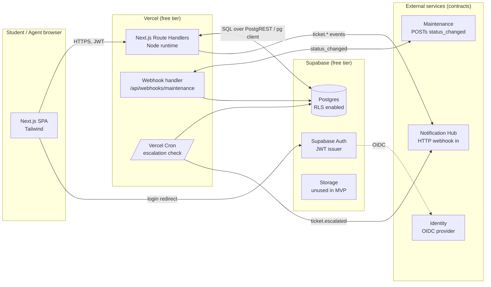

# Architecture — Helpdesk MVP

**Role:** Senior Software Architect
**Inputs:** `requirement.md`, `DataModel.md`
**Audience:** a 3–5 person student team, 1 semester, 0 THB budget.
**Guiding rule:** *simplicity over theoretical scalability.*

---

## 1. Constraints Recap

| # | Constraint | Implication |
|---|---|---|
| C1 | Student team, 3–5 devs | Prefer familiar, well-documented stacks. Tutorials and AI code-assist support matter. |
| C2 | 1 semester (≈ 4 months) | Time-to-first-screen beats peak throughput. |
| C3 | 0 THB | Only **free tiers**. Watch quotas. |
| C4 | No microservices | **One deployable web app + one managed DB**. No message broker, no separate worker fleet. |
| C5 | External dependencies (Identity, Notification Hub, Maintenance) | Treat them as **contracts** — stub them in dev, plug in prod (CON-05). |
| C6 | Schema has FKs, CHECK, enums, joins (queue view) | **Needs a real relational DB.** NoSQL will fight us. |
| C7 | Permission matrix per role (Requester/Agent/Admin) | Push enforcement **as close to the data as possible** (RLS if available). |

---

## 2. Non-Negotiable Architectural Principles

1. **One web app, one database.** No microservices.
2. **Relational DB with enforced constraints** (FKs, CHECK, enums).
3. **Permissions enforced at the DB**, not just in the API.
4. **Auth is delegated**, not invented. No password columns. (NFR-04)
5. **One-command local dev** (NFR-07): `docker compose up` or equivalent.
6. **External integrations are swappable stubs** (CON-05).
7. **No LLM, no message broker, no scheduled workers** in MVP — cron-on-the-edge or DB-side triggers only.
8. **All timestamps UTC, generated by the DB**, not the client.

---

## 3. Option 1 — Vercel + Supabase

A managed Next.js app talking to a managed Postgres with built-in Auth, Storage, and Row-Level Security.

| Layer | Choice |
|---|---|
| **Frontend** | Next.js 14+ (App Router), React, TypeScript. Tailwind for styling. |
| **Backend / API** | Next.js **Route Handlers** (`app/api/.../route.ts`) running on Node.js runtime. ~7 endpoints from `PRD_Helpdesk.md` + auth callbacks. |
| **Database** | **Supabase Postgres 15**. Schema managed via SQL migrations. |
| **Authentication** | **Supabase Auth** (configured as OIDC client of campus Identity in prod; used as-is in dev — see §10). JWT verified by API. |
| **Authorization** | **Postgres Row Level Security (RLS)** policies keyed off `auth.uid()` and a `role` claim from the JWT. Maps directly to the permission matrix in `requirement.md` §4. |
| **Storage** | Supabase Storage (1 GB free) — **reserved but unused in MVP** (no attachments in scope). |
| **Events (out)** | `app/api/events/route.ts` accepts internal publishes; for MVP demo, also writes to a `events` outbox table + logs to stdout. |
| **Events (in)** | `app/api/webhooks/maintenance/route.ts` consumes `maintenance.status_changed`. |
| **Hosting / Deploy** | **Vercel Hobby** (free): git push → preview + prod. **Supabase Free**: 500 MB DB, 2 projects, 50 k MAU. |
| **Local dev** | `supabase start` (Docker) → local Postgres + GoTrue + Storage. `next dev` on :3000. |

### Advantages
- **Postgres fits our schema 1:1.** FKs, CHECK, enums, `LOWER(name) WHERE is_active` partial unique index — all native.
- **RLS = permission matrix in SQL.** A bug in the API can't bypass "Requesters can only see their own tickets" (BR-02).
- **Most-taught stack for students.** Next.js + Postgres + Supabase is in every tutorial and every AI code assistant's training set.
- **One-command local stack** — `supabase start` brings up Postgres + Auth + Studio in Docker. Matches NFR-07.
- **Realtime is a checkbox**, not a service to operate — useful later for the agent queue without adding infra.
- **External Identity integration is trivial:** Supabase Auth supports OIDC; in dev we use Supabase Auth directly as a stand-in (CON-05).

### Disadvantages
- **Serverless cold starts** on Vercel — first request after idle can be ~1 s. Acceptable for a helpdesk.
- **Two platforms to learn** (Vercel + Supabase) — but the concepts overlap heavily and both have generous docs.
- **500 MB DB cap** — enough for one academic year of MVP traffic (200 tickets/day × 365 × ~5 KB ≈ 365 MB, still inside).
- **Vercel Hobby has 10 s function timeout** — fine for our endpoints, but no long jobs.

### Major Risks
| Risk | Likelihood | Impact | Mitigation |
|---|---|---|---|
| Supabase free-tier project policy changes | Low | High | Self-hostable later (Supabase is OSS). Schema is portable Postgres. |
| Vercel cold starts during demo | Medium | Low | Use Vercel's "warm" via scheduled pings, or accept it. |
| External Identity not ready | Medium | Medium | Use Supabase Auth in dev, document OIDC swap. |
| Student devs new to RLS | Medium | Medium | Spend half a day writing policies from `requirement.md` §4 together. |
| Free-tier quota exhaustion | Low | Medium | Monitor in Vercel/Supabase dashboards. |

---

## 4. Option 2 — Cloudflare Workers + D1

Edge-first stack: a React SPA on Cloudflare Pages, serverless Workers, and Cloudflare's managed SQLite (D1).

| Layer | Choice |
|---|---|
| **Frontend** | React (Vite) or SvelteKit, deployed to **Cloudflare Pages** (unlimited bandwidth free). |
| **Backend / API** | **Cloudflare Workers** (V8 isolates, not Node). 100 k requests/day free. |
| **Database** | **D1** (SQLite at the edge). 5 GB storage, 5 M reads/day, 100 k writes/day free. |
| **Authentication** | **Auth.js (NextAuth)** on Workers, or a third-party like Clerk (free tier 10 k MAU). Or hand-rolled with `iron-session`. |
| **Storage** | **R2** (S3-compatible object storage). 10 GB free. |
| **Events (out)** | Queues (Cloudflare Queues, 1 M operations/month free) or a DB outbox + cron trigger. |
| **Events (in)** | A Worker route triggered by a public webhook URL. |
| **Hosting / Deploy** | Wrangler CLI; git push auto-deploys to Pages. |
| **Local dev** | `wrangler dev` + `miniflare` (in-memory D1 emulation). |

### Advantages
- **Extremely generous free tier** — 5 GB DB, 100 k requests/day, 10 GB R2.
- **Edge-fast globally** — Workers run close to the user.
- **R2 has zero egress fees** — friendly for any future asset-heavy feature.
- **No cold starts in the traditional sense** — V8 isolates start in <5 ms.

### Disadvantages
- **D1 is SQLite, not Postgres.** No native enums, no JSONB, partial unique indexes need workarounds, CHECK constraints are SQLite-flavored.
- **Workers runtime is V8 isolates — not Node.** Any npm library that uses `fs`, `crypto.scrypt`, native bindings, etc. will fail. Students will hit this.
- **CPU time cap on free Workers** (~10 ms wall time on free plan). Anything heavier needs paid Workers Unbound.
- **Auth is the weak link.** Cloudflare Access is enterprise; for app auth you'd roll your own or use Auth.js/Clerk — extra dependency.
- **Smaller ecosystem** for student devs. Fewer Stack Overflow answers, fewer AI-trained patterns.

### Major Risks
| Risk | Likelihood | Impact | Mitigation |
|---|---|---|---|
| npm library incompatibility with V8 runtime | High | Medium | Audit dependencies early; keep dependencies minimal. |
| SQLite concurrency on writes | Low–Medium | Medium | Single writer serialization; fine at our volume (≤200/day) but watch if it grows. |
| Auth complexity eating sprint time | Medium | High | Pick Auth.js with email magic-link to avoid OIDC plumbing. |
| D1 maturity (FK support, migrations tooling) | Low | Medium | FKs now supported, but plan migrations carefully. |
| Cold-start in *demo* still exists for Pages functions | Low | Low | Pre-warm critical routes before demo. |

---

## 5. Option 3 — Firebase

Google-managed platform: Hosting + Cloud Functions + Firestore (NoSQL) + Firebase Auth + Storage.

| Layer | Choice |
|---|---|
| **Frontend** | React/Vue/whatever on **Firebase Hosting** (10 GB free). |
| **Backend / API** | **Cloud Functions for Firebase** (Node 20). 2 M invocations/month free. |
| **Database** | **Firestore** (NoSQL document store). 1 GB storage, 50 k reads/day, 20 k writes/day free. |
| **Authentication** | **Firebase Auth** — easiest of the three. Email/password, OAuth, phone. |
| **Storage** | **Firebase Storage** (Cloud Storage). 5 GB free. |
| **Events (out)** | Firestore triggers or Cloud Functions callable. (No message broker — events fire from DB writes.) |
| **Events (in)** | HTTPS Cloud Function endpoint. |
| **Hosting / Deploy** | Firebase CLI (`firebase deploy`). |
| **Local dev** | Firebase Emulator Suite (Auth + Firestore + Functions + Hosting locally). |

### Advantages
- **Easiest auth of the three** — Firebase Auth works out of the box with most providers.
- **Emulator Suite** is solid for local dev.
- **Realtime sync for free** — every Firestore read can be a live subscription.

### Disadvantages
- **Firestore is NoSQL — fights our schema.** No joins, no OR across fields, no aggregations, weak consistency guarantees for complex queries.
- **The queue view (`ORDER BY priority DESC, created_at ASC` joined with `Category` and `User`)** requires **denormalization**, which means duplicate data and inconsistency risk — directly contradicts DataModel §10.
- **Permissions are written as `security.rules`**, not SQL — different mental model, easy to get wrong.
- **Vendor lock-in is deep.** Migrating off Firestore means re-modeling every collection.
- **Per-operation pricing** is a footgun if usage spikes (even on free tier, the quotas are easy to hit).
- **No transactional integrity across collections** — multi-step workflows need careful design.

### Major Risks
| Risk | Likelihood | Impact | Mitigation |
|---|---|---|---|
| Queue query can't be expressed efficiently | **High** | **High** | Denormalize, accept inconsistency, build reconciliation script. |
| 50 k reads/day limit hit during agent triage | Medium | High | Cache aggressively; or pay (not allowed in MVP). |
| Schema migration in Firestore is painful | Medium | Medium | Version every document with a `schemaVersion` field. |
| Realtime listeners cost more than they save in our use case | Low | Low | Don't enable realtime listeners in MVP. |
| Lock-in if we want to leave Firebase | Low (now) | High (later) | Avoid Firebase-specific APIs in business logic. |

---

## 6. Side-by-Side Comparison

| Criterion | Vercel + Supabase | Cloudflare Workers + D1 | Firebase |
|---|---|---|---|
| DB model | **Postgres ✅** | SQLite | Firestore (NoSQL) |
| Schema fidelity (FKs, enums, CHECK) | Full | Partial | None |
| Permission model maps cleanly | **RLS ✅** | App-level | Rules DSL |
| Free-tier DB size | 500 MB | 5 GB | 1 GB |
| Free-tier monthly requests | Generous | 100 k req/day | 50 k reads + 20 k writes /day |
| Auth simplicity | High (Supabase Auth) | Medium (Auth.js / Clerk) | **Highest** |
| Familiarity to student devs | **Highest** | Medium | High |
| AI code-assist support | **Best** | Medium | Medium |
| Risk of quota exhaustion | Low | Low | Medium |
| Vendor lock-in | Low (OSS Supabase) | Low (OSS Workers runtime) | High |
| Cold-start concerns | Mild | Negligible | Mild |
| Local dev one-liner | `supabase start` ✅ | `wrangler dev` | Emulator suite ✅ |
| Fits our data model? | **Yes ✅** | Mostly | **No** |

---

## 7. Recommendation: **Option 1 — Vercel + Supabase**

Pick this. It's the only option where **no part of the architecture fights the data model or the permission matrix**.

### Why this is the right call for *this* project

1. **The data model is the constraint that decides.** Our schema has FKs, CHECK constraints, enums, partial unique indexes, and a queue view that joins `Ticket ⨝ Category ⨝ User`. That is a Postgres workload. D1 can do most of it; Firestore can't.
2. **Permissions enforced at the DB (RLS).** The permission matrix in `requirement.md` §4 becomes a set of `CREATE POLICY` statements. A bug in any API endpoint can't accidentally let a Requester read all tickets (BR-02). This is impossible to retrofit cheaply later.
3. **Student-team familiarity.** Next.js + Postgres + Supabase is the stack with the most tutorials, the most Stack Overflow answers, and the strongest representation in AI code-assist training data. When a 3-person team hits a wall at 11 pm before a deadline, "findable answers" is worth more than 10 ms cold starts.
4. **Free tier comfortably fits.** 500 MB Postgres = tens of thousands of tickets; we need ~50 k for a year at MVP volume.
5. **One-command local dev** (NFR-07). `supabase start` plus `next dev` is exactly two terminals.
6. **External integrations are swappable.** Supabase Auth can act as an OIDC client of the real campus Identity when it's ready, or run standalone in dev (CON-05).
7. **Migration path is clean.** If the project outgrows Vercel/Supabase, the schema is plain Postgres and the app is plain Next.js. Nothing exotic to unwind.

### What we are deliberately trading away

- A few hundred ms of cold-start latency on the first request of the day. Acceptable.
- ~100 ms of geographic edge latency vs. Cloudflare. We don't have global users; the campus is one place.
- A slightly more verbose local dev story than Firebase's emulator suite. We get a better schema story in return.

### Why not Cloudflare
- V8 runtime + SQLite is real friction for a team that doesn't already know it. The "10 ms CPU on free plan" cap means we can't do anything CPU-heavy (PDF gen, image resize, anything sync) without paid Workers — and we're not paying.
- Auth is the part of Cloudflare that's least polished for app use; we'd burn sprint time there.

### Why not Firebase
- The queue view alone is enough to disqualify it. We'd be denormalizing `Category` and `User` into every `Ticket` document just to read the agent queue — and we'd be debugging inconsistency for the rest of the semester.

---

## 8. System Diagram



> All arrows are HTTPS. The DB is the single source of truth. Auth issues JWTs; the API verifies them; RLS uses `auth.uid()`.

---

## 9. Component Responsibilities

| Component | Owns | Does NOT own |
|---|---|---|
| **Next.js UI** | Screens: Create Ticket, My Tickets, Ticket Detail, Agent Queue, Admin Counts, Category Manager. | Auth, persistence, authorization. |
| **Next.js API (Route Handlers)** | Request validation, orchestration, publishing events, calling out to Notification Hub. | Direct DB writes that should be policy-gated (those go through PostgREST or RLS-aware queries). |
| **Postgres + RLS** | Source of truth. Enforces FKs, CHECK, state-machine guard via trigger or app. Enforces permission matrix via policies. | Sending notifications. |
| **Supabase Auth** | Issue/verify JWTs, manage sessions, OIDC dance with Identity. | Role assignment beyond default `Requester` (we promote to Agent/Admin via a seed script — see §10). |
| **Vercel Cron** | Nightly job: (a) auto-close Resolved tickets older than 7 d (BR-05); (b) publish `ticket.escalated` for Urgent + unassigned > 1 h (BR-09). | Anything real-time. |
| **Webhook handler** | Verify signature of `maintenance.status_changed`, look up ticket by `maintenance_work_order_id`, update status (only if link is still current — DataModel §6). | Sending notifications back to Maintenance. |
| **External: Identity** | Real authentication in production. | Anything in our domain. |
| **External: Notification Hub** | Fan-out to email/LINE/push when we publish events. | Anything else. |
| **External: Maintenance** | Owns work-orders; tells us when they change. | Our ticket state. |

---

## 10. Key Flows

### 10.1 Student creates a ticket
1. Student opens `/tickets/new` in the SPA.
2. SPA calls `POST /api/tickets/suggest` (or just runs rules client-side) → gets suggested `{category_id, priority}`.
3. SPA submits `POST /api/tickets` with the form data.
4. API validates input, inserts one row into `tickets`. RLS allows the insert because `requester_id = auth.uid()`.
5. API writes one row into the `events` outbox (`ticket.created`).
6. A small inline worker (or the next API call's tail) pushes the outbox row to Notification Hub.
7. API returns `{id: "T-000123"}`. SPA redirects to `/tickets/T-000123`.

### 10.2 Agent resolves a ticket
1. Agent opens `/queue`, sorts by priority. SPA calls `GET /api/tickets?status=Open&sort=priority,age`.
2. RLS policy allows Agents to read all rows. Requesters only their own.
3. Agent clicks **Resolve**, adds a note. SPA calls `PATCH /api/tickets/{id}` with `{status: "Resolved", resolution_note: "..."}`.
4. API verifies the state-machine transition is legal (BR-01).
5. DB updates the row and triggers write to `events` outbox (`ticket.resolved`).
6. Outbox publisher fans out to Notification Hub → requester gets notified.

### 10.3 Maintenance event arrives
1. Maintenance system POSTs `{work_order_id, status}` to `/api/webhooks/maintenance` with an HMAC signature.
2. Webhook handler verifies signature (constant-time compare).
3. Handler reads the ticket by `maintenance_work_order_id`.
4. **Guard:** if the link has since been changed/cleared, ignore the event (DataModel §6).
5. Otherwise update the ticket's `status` accordingly, write to `events` outbox.

### 10.4 Escalation (BR-09)
- Vercel Cron runs every 15 minutes.
- Query: `SELECT id FROM tickets WHERE priority='Urgent' AND status='Open' AND assignee_id IS NULL AND created_at < now() - interval '1 hour' AND escalated_at IS NULL`.
- For each: set `escalated_at = now()`, write `ticket.escalated` event.
- Idempotent: `escalated_at IS NULL` guard.

---

## 11. Local Development

```bash
# one-time
npm install
npx supabase init

# every day — two terminals
# terminal 1: local Postgres + Auth + Studio
npx supabase start
# → prints API URL, anon key, service role key

# terminal 2: Next.js
npm run dev
```

Migrations:
```bash
npx supabase migration new init
# write SQL → supabase/migrations/<timestamp>_init.sql
npx supabase db push        # apply to local
npx supabase db push --linked   # apply to hosted (when ready)
```

Seed: a `supabase/seed.sql` creates 3 demo users (one per role), 5 categories, and a couple of sample tickets. Roles for Agents/Admins are set via a small script (`scripts/promote.sql`) because Auth doesn't know about our `role` column by default.

---

## 12. Deployment

| Step | Where | How |
|---|---|---|
| Push code | GitHub | `git push` |
| Deploy app | Vercel | Auto on push to `main`; preview URLs for PRs |
| Apply schema | Supabase | `supabase db push --linked` from CI |
| Set env vars | Vercel dashboard | `NEXT_PUBLIC_SUPABASE_URL`, `NEXT_PUBLIC_SUPABASE_ANON_KEY`, `SUPABASE_SERVICE_ROLE_KEY` (server only), `MAINTENANCE_WEBHOOK_SECRET`, `NOTIFICATION_HUB_URL` |
| Configure OIDC | Supabase dashboard | Add campus Identity as external OIDC provider (production only) |

Domain: free `*.vercel.app` for MVP. Custom domain later (still free on Vercel Hobby if you own one).

---

## 13. Risk Register

| ID | Risk | Likelihood | Impact | Owner | Mitigation |
|---|---|---|---|---|---|
| R1 | External Identity not ready by demo | Medium | Medium | Team | Run on Supabase Auth in dev; document OIDC swap. |
| R2 | Supabase free-tier policy changes | Low | High | Team | Schema is plain Postgres; Supabase is OSS → self-hostable. |
| R3 | Notification Hub endpoint changes shape | Medium | Medium | Team | Wrap all outbound calls in `lib/notify.ts` with one place to update. |
| R4 | Maintenance webhook never delivered in MVP | Medium | Low | Team | Build the consumer anyway; demo with a `curl` from a script. |
| R5 | Student team new to RLS | Medium | Medium | Team | Day-1 task: port the permission matrix from `requirement.md` §4 into policies. |
| R6 | Outbox publisher not implemented | Medium | Medium | Team | Start with synchronous publish + log-on-failure; upgrade to outbox if time permits. |
| R7 | Free-tier quotas hit during demo | Low | Medium | Team | Monitor dashboards; have screenshots queued in case. |
| R8 | Cold start during live demo | Low | Low | Presenter | Hit `/` 5 min before the demo. |

---

## 14. Explicit Non-Goals for the Architecture

These are *intentionally absent*; bringing them in would violate C1–C4.

- ❌ Separate notification service (we call Notification Hub, we don't run one)
- ❌ Separate worker fleet (cron + edge functions only)
- ❌ Message broker (Kafka / Pub/Sub / RabbitMQ)
- ❌ Redis / cache layer
- ❌ API Gateway / WAF / rate-limit service
- ❌ Container orchestration (Kubernetes, ECS, Nomad)
- ❌ Service mesh, distributed tracing infra (we log to stdout and grep)
- ❌ Multi-region deployment
- ❌ GraphQL (REST is enough for 7 endpoints)
- ❌ gRPC / protocol buffers
- ❌ LLM/AI in the request path (CON-06)
- ❌ Real-time collaboration features (use Supabase Realtime later, only if a real need appears)

---

## 15. Traceability

| Architecture decision | Driven by |
|---|---|
| Postgres (not SQLite, not NoSQL) | DataModel §1, §11 (FKs, CHECK, enums, partial unique index, joins) |
| RLS at DB | `requirement.md` §4 (role matrix), BR-02/BR-04, NFR-04 |
| Auth delegated | FR-01, NFR-04, CON-05 |
| One web app, no microservices | C1, C4 |
| Cron over a worker fleet | C2, C4, BR-09 |
| Outbox (optional, sync-first fallback) | BR-10, DataModel §7 |
| Stub-friendly integrations | CON-05 |
| Next.js (App Router) | C1 (familiarity), NFR-07 (one-command dev) |
| Vercel Hobby | C3 (free), NFR-07 (git push deploy) |
| Supabase Free | C3, fits within DataModel §10 capacity reasoning |

---

## 16. Summary in One Sentence

**One Next.js app on Vercel, one Supabase Postgres with RLS for authorization and Supabase Auth for identity, three thin HTTP edges for the three external teams — nothing else, because nothing else is needed for one semester at zero baht.**
